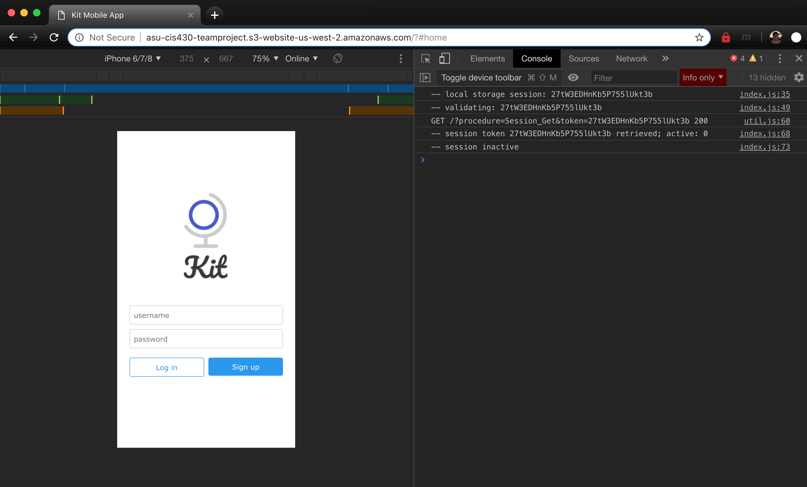
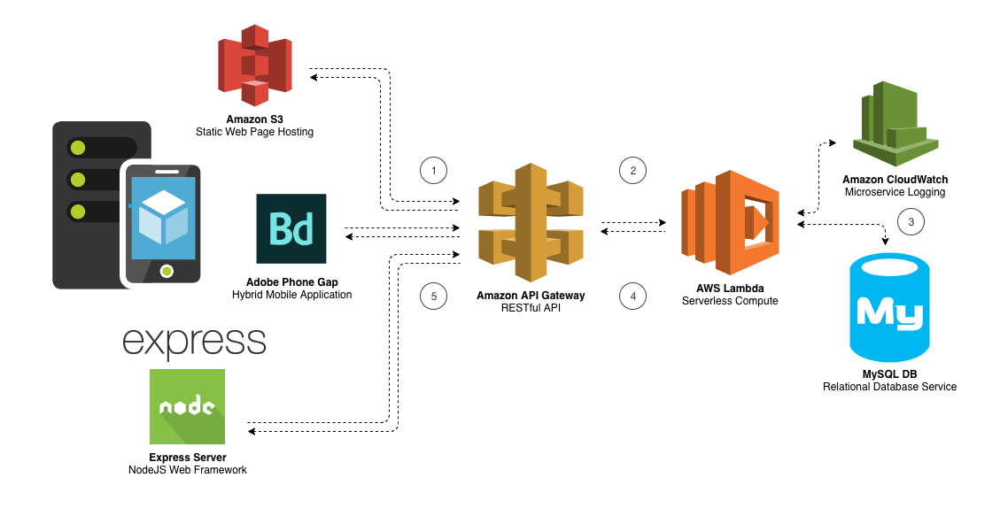

# Team Project #

<!-- This file uses Markdown and is best viewed in a Markdown file viewer. An alternative is to simply view the file online at https://github.com/cafitzp1/KitMobileApp (scroll down a bit once on the page) -->

## Alozzam - Team Members ##

- Jackson Roy
- Connor Fitzpatrick
- Colten Nelson
- Mack Mackey

## Serverless Hosting ##

A serverless version of our app can be viewed at any time from a browser by visiting https://s3-us-west-2.amazonaws.com/asu-cis430-teamproject/index.html. The app is made for mobile so it looks best when setting the page sizing to a mobile format in dev tools (where it says "iPhone 6/7/8" in our image), or when simply navigating to the URL on a mobile device.

## Solution File Structure ##

    .
    ├── bin
    │   └── www
    ├── db
    │   ├── migrations
    │   └── procedures
    ├── lambda
    │   ├── node_modules
    │   ├── config.js
    │   ├── dbHelp.js
    │   ├── index.js
    │   ├── index.zip
    │   ├── package-lock.json
    │   └── package.json
    ├── node_modules
    ├── routes
    │   ├── index.js
    │   └── users.js
    ├── www
    │   ├── assets
    │   ├── css
    │   ├── js
    │   ├── config.xml
    │   ├── error.html
    │   └── index.html
    ├── .gitignore
    ├── app.js
    ├── package-lock.json
    ├── package.json
    ├── README.md
    └── www.zip

### Explanation ###

Directory/File      | Association     | Explanation
---                 | ---             | ---
`bin/`              | *server*        | contains the app entry point file  (`www`) for when launching a server (run `npm start` in CLI)
`db/`               | *database*      | contains our app db scripts; `migrations` = db initialization, `procedures` = stored procedures
`lambda/`           | *app backend*   | serverless back end deployed on AWS lambda, accessible through an AWS API Gateway
`node_modules/`     | *server*        | contains node modules required for server functionalities
`routes/`           | *server*        | a place for defining route definitions used in `app.js`
`www/`              | *app frontend*  | our app package deployed to adobe phonegap build / contains all files served when accessing from local server or the S3 URL
`.gitignore`        | *misc*          | listing of files to ignore from git repository
`app.js`            | *server*        | initializes the app and glues everything together when launching a server
`package-lock.json` | *server*        | describes the exact tree that was generated for `node_modules/` modifications (for subsequent installs)
`package.json`      | *server*        | lists all the packages our solution depends on
`www.zip`           | *app frontend*  | zip file of `www/` directory for adobe phonegap build

The files/directories listed as *server* are for launching an the app via a NodeJS Express server. More can be read about the file structure in a typical Express app at https://developer.mozilla.org/en-US/docs/Learn/Server-side/Express_Nodejs/skeleton_website

## Architecture ##

1. The application (accessible from Amazon S3, the Apache Cordova / Phone Gap hybrid mobile application, or a local Express server) sends an HTTPS request to the Amazon API Gateway RESTful interface.
2. The Amazon API Gateway invokes the AWS Lambda function which uses a Node.js.8.10 runtime.
3. Lambda function handles the request, accessing user requested data from the MySQL database. All handled requests are recorded and stored through Amazon CloudWatch logs.
4. Lambda function returns results in an HTTP-formatted response to the RESTful API in Amazon API Gateway.
5. API Gateway returns the results to the application

## Testing ##

The following table is a listing of the current `SystemUser` accounts set up that will work with the application for testing purposes. `CurrentGroupID` associates accounts together in the "Manage Group" view. Changes cannot currently be made within the application but any updates to the database will reflect in the application in realtime. Ex: while logged into "jsmith", updating `CurrentGroupID` for "mwilson" to anything but `3` will make Mary disappear from the manage group page on the next polling interval (no refresh is necessary). Users can be added by invoking the `SystemUser_Create` proc, like this: `CALL SystemUser_Create("New User", "newuser@gmail.com", "nuser", "password", 0);`).

Username  | Password          | CurrentGroupID
---       | ---               | ---
jsmith    |	password          |	3
mwilson   |	password123       |	3
jjones    |	password123456789 |	3
djones    |	123456            |	7
mmiller   |	my_password1      |	7
cafitzp1  |	Monday!           |	7